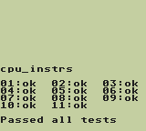
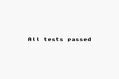
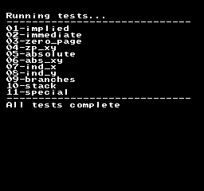
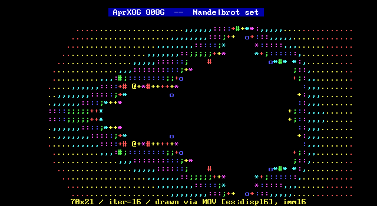
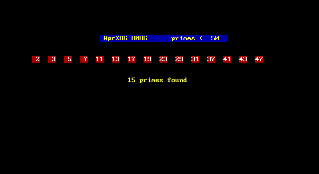
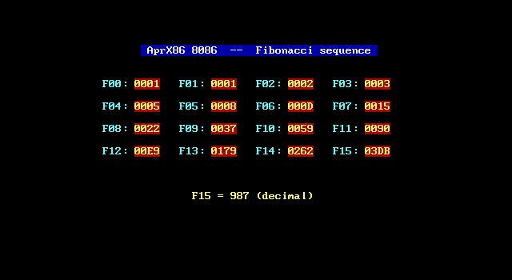

# AprGba — A JSON-driven CPU simulation framework

> A research project exploring whether an entire CPU emulator can be
> *generated* from a machine-readable specification — and whether the
> generated code can run fast enough to be practical.

**Last updated:** 2026-05-17 (Asia/Taipei) · **License:** [WTFPL v2](LICENSE) · **Tests:** 895/895 passing

## At a glance

| CPU | Block-JIT verifier (real ROM) | Random-ROM fuzzer |
|---|---|---|
| **x86-16** (i8086/i80186/i80286) | pcxtbios + FreeDOS, 5M blocks NoDiff | 0 divergences |
| **LR35902** (Game Boy DMG) | cpu_instrs.gb, **5M blocks NoDiff** | 0 div / 52+ seeds |
| **Ricoh 2A03** (NES) | blargg cpu_test5, 1M blocks NoDiff | 0 divergences |
| **ARM7TDMI** (GBA) | gba-tests/arm.gba, 3M blocks NoDiff | 0 divergences |

Six CPU variants share one framework. Memory bus + cycle table + interrupt
vectors + access widths + spec inheritance all **spec-driven** (i80186 /
i80286 land via JSON Merge Patch on i8086 with zero runtime overhead).
Block-JIT live for all four CPUs; 30+ test ROMs verified bit-identical
between JIT and INTERP backends across the verifier framework.

→ Skip to **[Quick start](#6-quick-start)** to try it.

## Recent milestones

| Date | Phase | What shipped |
|---|---|---|
| 2026-05-17 | **30.15d–30.18** | Verified Block-JIT framework + 4-CPU differential fuzzer. 7 root-cause bugs fixed (SyncEmitter PC clobber, MBC bank-switch, conditional-branch defer-sync, R15-write detection, INC/DEC (HL) flag ordering, IRQ-cadence, HALT-spin). All 4 CPUs now at multi-million-block NoDiff. [Closure note.](MD/performance/202605171533-verifier-and-fuzzer-closure.md) |
| 2026-05-16 | **30.14** | DOS test-binary injection workflow (port 0xE9 hook, `--floppy-b`, FAT12 builder). [Workflow doc.](MD/process/03-dos-test-injection-workflow.md) |
| 2026-05-16 | **30.12** | Tseng ET4000 VGA BIOS as option ROM (smoke-test only). |
| 2026-05-16 | **30** | 8272 FDC + 8237 DMA + real-BIOS path: `apr-pc --bios=pcxtbios.bin --floppy-a=freedos.img` boots FreeDOS with **zero HLE intercept**. Fixed `ROL r/m16, CL` emitter as part of the chain. [Plan.](MD/design/30-fdc-dma-plan.md) |
| 2026-05-16 | **29** | Intel 8087/80287 FPU as orthogonal coprocessor mix-in (~30 ESC opcodes). [Closure.](MD/performance/202605160100-x87-fpu-functional-complete.md) |
| 2026-05-15 | **28** | Intel PC emulator → FreeDOS boots end-to-end on JSON-driven CPU framework. [Closure.](MD/performance/202605152200-pc-emulator-freedos-boot.md) |

For the full history see [`MD/design/03-roadmap.md`](MD/design/03-roadmap.md).

## Verified Block-JIT framework + differential fuzzer

The framework's biggest correctness milestone. Per-block, the verifier
snapshots state, runs JIT once with trace capture, restores to a parallel
INTERP env, runs INTERP the same N instructions, then **3-axis compares**
(CPU state + memory-write trace + side-effect log). The companion fuzzer
generates random-instruction-stream ROMs and feeds them through the
verifier — surfaces emitter / cadence / spec-ordering bugs that
hand-curated test ROMs miss.

```bash
# Verifier (each CPU)
apr-pc  --bios=... --floppy-a=... --verify-blocks --max-cycles=1000000
apr-gb  --rom=test-roms/blargg-cpu/cpu_instrs.gb       --verify-blocks=1000000
apr-nes --rom=test-roms/blargg_nes_cpu_test5/cpu.nes   --verify-blocks=1000000
apr-gba --rom=test-roms/gba-tests/arm/arm.gba          --verify-blocks=1000000

# Random-ROM fuzzer (each CPU)
apr-gb  --fuzz=100 --fuzz-blocks=50 --fuzz-seed=42 --fuzz-continue
# (same flags for apr-nes / apr-gba / apr-x86)
```

How-to: [`MD/process/05-verified-blockjit-howto.md`](MD/process/05-verified-blockjit-howto.md) ·
Design: [`MD/design/30.15d-verified-blockjit-framework-design.md`](MD/design/30.15d-verified-blockjit-framework-design.md)

---

## English

### 1. What is this project, really?

The repository is named **AprGba**, and you'll find a Game Boy Advance harness inside. **But GBA is not the goal.** The actual product of this project is **`AprCpu`** — a JSON-driven CPU simulation *framework*. The GBA emulator is the test vehicle that proves the framework can be pushed to a non-trivial, real-world workload (commercial-grade ARM7TDMI emulation with LLVM block-JIT).

Think of it this way:

| Component | Role |
|---|---|
| **`AprCpu`** | The framework. CPU spec loader + decoder generator + IR emitters + LLVM JIT runtime + block detector + cache + page-table dispatch + lockstep diff toolkit + spec inheritance. **This is the core.** |
| **`AprGba`** | One concrete consumer of the framework — full GBA system (ARM7TDMI + Thumb + memory bus + PPU + scheduler). Used to push `AprCpu` to its limits. |
| **`AprGb`** | A second consumer — Game Boy DMG (LR35902 / SM83). Used as a *control case* and to prove the framework genuinely supports a second, different ISA. |
| **`AprNes`** | A third consumer — NES (Ricoh 2A03 / MOS 6502). Adds variable-width 1-3 byte 8-bit ISA with the framework's most extreme declarativity exercise: ~85% of the runtime (memory bus, cycle table, interrupt vectors, region routing) drives off `spec/cpu/2a03/*.json` + `spec/machines/nes-ntsc.json`. |
| **`AprX86`** | A fourth consumer — Intel x86-16 family (i8086 / 8088 / i80186 / 80188 / i80286). Validates spec **inheritance** (`spec/cpu/x86-16/i80286/cpu.json` extends i80186 extends i8086, depth 3). i80286 protected-mode segmentation + 4-check fault model end-to-end demoable. |

### 2. Why does this project exist?

#### The problem

Writing a CPU emulator is a frequently-rediscovered chore. Every new platform — every new homebrew console, every retro-computing project, every "let me try emulating an X" — leads to the same hand-coded dispatcher loop, the same opcode `switch` statement copy-pasted with new bit fields, the same flag-update boilerplate, the same partial-register stalls and pipeline-PC quirks rediscovered the hard way.

There are excellent emulators out there (mGBA, Dolphin, QEMU, FCEUX). But they're each tightly coupled to *their* CPU. Porting an mGBA-quality JIT to a new ISA usually means writing a new emulator.

#### The hypothesis

> **What if the CPU were a JSON file?**

What if the entire ISA — encoding patterns, register file layout, condition codes, micro-op semantics, cycle costs, pipeline behaviour — were declarative data, and the emulator framework could compile that data into a working interpreter *and* a working LLVM JIT?

#### The goals, in priority order

1. **Build a framework that's actually generic.** Not "generic in theory" — generic in the sense that genuinely different CPUs (ARM7TDMI + LR35902 + Ricoh 2A03 + Intel x86-16) compile through the same pipeline with no per-CPU C# code in the emit pipeline.
2. **Take the framework all the way to block-JIT.** Per-instruction interpreters are easy to make generic. The hard part is whether the framework can survive the architectural pressure of LLVM JIT, cycle accounting, IRQ delivery, SMC detection, and pipeline-PC quirks — *while staying spec-driven*.
3. **Validate against real workloads.** Pass Blargg's `cpu_instrs.gb`, jsmolka's ARM/Thumb tests, blargg NES `cpu_test5`, Tom Harte's 8088 SST (1.31M cases). Boot the GBA BIOS via LLE. Render canonical screenshots with cycle-accurate matrix tests.
4. **Stress the framework with spec inheritance.** Adding new CPUs in the same ISA family should cost a JSON diff, not a re-implementation. The Intel x86-16 chain (8086 → 80186 → 80286, with full 80286 protected-mode segmentation + fault model) shipped in this mode and serves as the proof.
5. **Document the design philosophy.** Every trade-off recorded. Every architectural pattern named. Future maintainers — including future-me — should be able to tell *why* a design choice was made, not just *what* the code does.

#### What this project is **not**

- **Not** a competitor to mGBA. mGBA is a polished end-user emulator; we are a research framework.
- **Not** chasing maximum cycle accuracy. We are deliberately at "instruction-grained timing accuracy with sync exits at HW-relevant moments" — enough for commercial ROMs, not enough for cycle-perfect demoscene work.
- **Not** trying to be the fastest emulator. The framework's value is *generality*, not raw speed. (That said: the Intel 8086 block-JIT path runs at 218 MIPS on a tight inner loop — 5.65× faster than a hand-coded interpreter — once Gemini-suggested LLVM CFG superblocks were in place.)

#### Proof of execution — test ROM screenshots

Visual evidence the framework actually runs correctness-grade workloads end-to-end:

##### Game Boy — Blargg `cpu_instrs.gb` (JSON-LLVM block-JIT path)



Run command: `apr-gb --rom=test-roms/gb-test-roms-master/cpu_instrs/cpu_instrs.gb --cpu=json-llvm --block-jit --frames=10000`. The serial output ends with **"Passed all tests"**. All 11 sub-tests pass through the JSON-driven LR35902 spec compiled to LLVM IR and run via ORC LLJIT block-JIT.

##### Game Boy Advance — jsmolka `arm.gba` and `thumb.gba` (BIOS LLE path)




Run command: `apr-gba --rom=test-roms/gba-tests/arm/arm.gba --bios=BIOS/gba_bios.bin --block-jit`. **LLE** = *Low-Level Emulation* — instead of HLE-stubbing the BIOS calls, we execute the actual Nintendo GBA BIOS through our ARM7TDMI emulation. Both ARM-mode and Thumb-mode test groups pass — covering ~5000+ test vectors per mode across every ARM7TDMI instruction class (data-processing, multiply, single/block data transfer, branch, PSR transfer, SWI, mode switches).

##### NES — blargg `cpu_test5/cpu.nes` (JSON-block JIT path, Ricoh 2A03)



Run command: `apr-nes --rom=test-roms/blargg_nes_cpu_test5/cpu.nes --run --max-cycles=110000000 --backend=json-block --screenshot=...`. The PPU nametable is rendered as a CGA-style PNG. blargg's `cpu_test5/cpu.nes` covers MOS 6502 official + unofficial opcodes through the JSON-driven Ricoh 2A03 spec compiled via SpecCompiler → LLVM IR → ORC LLJIT block-JIT. The "All tests complete" string is the test ROM's own success signal.

##### Intel 8086 — CGA text-mode demos (legacy + json-block backends)







These are hand-crafted .com binaries running through the Intel 8086 backend (`apr-x86 --rom=... --backend=json-block --variant=i8086`). The CGA text-mode framebuffer (80×25 chars × 16 colors, 8×14 glyphs) is rendered to PNG by a small renderer in the harness; the CPU itself is **fully JSON-driven** — no per-instruction C# code in the emit pipeline.

The mandelbrot demo computes the Mandelbrot set in fixed-point integer math and renders it with ASCII shading — exercises ALU / control flow / nested loops / signed comparison through the framework. All six 8086 demos (hello-cga / primes / fibonacci / mandelbrot / string-copy / factorial) produce **byte-identical PNGs across all three backends** (legacy / json-llvm / json-block), validating end-to-end framework correctness.

##### Intel 80286 — protected-mode fault matrix (5-ROM CLI demo)

The 80286 backend has no integrated CGA renderer (yet); protected-mode segmentation is demoed via a 5-ROM **fault matrix**. Each ROM is a 96-byte hand-crafted `.com` (assembled from NASM source under `test-roms/x86/src/27-pmode-*.asm`), entering protected mode via `LMSW` and then loading a segment register with a deliberately-malformed selector. The 80286 backend's descriptor-fetch + 4-check fault pipeline (P-bit / NULL-SS / DPL / type) catches each violation:

| ROM | Selector → reg | Descriptor | Architectural outcome | Observed |
|---|---|---|---|---|
| `27-pmode-entry.com` | `0x0008 → DS` | P=1, S=1, DPL=0, writable data | OK; `mov bx,[0]` reads DS_BASE=0x100 | `BX=0xF1B8`, no EXC |
| `27-pmode-np.com` | `0x0008 → DS` | **P=0** | `#NP(sel)` per Intel | `EXC vector=0x0B error=0x0008` |
| `27-pmode-null-ss.com` | `0x0000 → SS` | (NULL) | `#GP(0)` per Intel | `EXC vector=0x0D error=0x0000` |
| `27-pmode-dpl-gp.com` | `0x000B → DS` (RPL=3) | DPL=0 | `#GP(sel)`: max(CPL=0,RPL=3) > DPL=0 | `EXC vector=0x0D error=0x0008` |
| `27-pmode-ss-bad-type.com` | `0x0008 → SS` | type=executable code | `#GP(sel)`: SS demands writable data | `EXC vector=0x0D error=0x0008` |

These 6 screenshots + 5 fault-matrix ROMs together demonstrate that the **same `AprCpu` framework**, with **the same `BlockFunctionBuilder` / `EmitContext` / micro-op registry**, compiles and correctly executes:
1. A variable-width 8-bit CPU (LR35902) with prefix-byte sub-decoding
2. ARM-mode 32-bit fixed-width with 16-condition-code dispatch
3. Thumb-mode 16-bit fixed-width with 19 distinct encoding formats
4. A variable-width 8-bit CPU with unofficial opcodes (Ricoh 2A03 / MOS 6502)
5. A 16-bit CISC family (Intel 8086 / 80186 / 80286) with segmented memory, ModR/M, prefix bytes, and **descriptor-based protected-mode segmentation + 4-check fault model**

— without any per-CPU C# code in the emit pipeline. **This is the core claim of the project, and these images + ROMs are the proof.**

### 3. Honest acknowledgement: the `AprGb` legacy interpreter

The Game Boy interpreter under `src/AprGb.Cli/Cpu/LegacyCpu*` is **not** original to this project. It is imported from an earlier hand-coded emulator of mine — see [erspicu/AprGBemu](https://github.com/erspicu/AprGBemu).

Why import it?

1. **Provide a reference oracle.** Lockstep diff against a known-good interpreter is invaluable when developing a JSON-driven path. Every Blargg PASS we celebrate gets cross-checked against the legacy interpreter producing identical state.
2. **Establish a perf baseline.** The legacy interpreter runs cpu_instrs at ~31 MIPS — early on this was faster than our JIT. (For 8086, after Gemini-suggested LLVM CFG superblocks, json-block hits **218 MIPS**, 5.65× over legacy on the bench loop.)
3. **Demonstrate the framework's real value isn't raw speed.** It's *generality*. The same `AprCpu` pipeline that compiles ARM7TDMI also compiles LR35902, Ricoh 2A03, and Intel x86-16 — no architectural hardcoding.

### 4. What's interesting about the framework?

Beyond "JSON in, working emulator out", these are the framework-level designs that took deliberate effort and are documented in [`MD_EN/design/`](MD_EN/design/):

- **Spec inheritance via JSON Merge Patch (RFC 7386).** Within one ISA family, a child spec is a diff over the parent's resolved spec — `spec/cpu/x86-16/i80186/cpu.json` adds 26 instructions on top of i8086 (~330 lines vs ~3000 from scratch); `spec/cpu/x86-16/i80286/cpu.json` adds the system instructions + protected-mode plumbing on top of that. Inheritance is **build/load-time data overlay**: SpecLoader merges the chain once at load time, downstream (SpecCompiler / DecoderTable / runtime) sees no hierarchy at all. Zero runtime overhead — i80186 perf == i8086 perf on shared workloads. See [`MD_EN/design/23-cpu-spec-inheritance.md`](MD_EN/design/23-cpu-spec-inheritance.md).
- **Variable-width detection without spec coupling.** A `lengthOracle` callback turns a 256-entry static table into a per-CPU plug-in. ARM (4-byte fixed), Thumb (2-byte fixed), LR35902 (1-3 byte variable, with 0xCB-prefix sub-decoder), Intel x86 (1-7 byte variable, with prefix bytes / ModR/M / SIB / disp / imm) all share the same `BlockDetector`.
- **Intel 80286 protected-mode segmentation, fully spec-driven.** When `MSW.PE = 1`, the i80286 backend fetches an 8-byte descriptor from the GDT, validates it through 4 baseline checks (P-bit / NULL-SS / DPL/RPL/CPL privilege / segment type), and populates the hidden segment-register cache; subsequent ModR/M memory accesses use `<seg>_BASE` from the cache, not `(visible-selector << 4)`. Validation faults set `EXC_PENDING` / `EXC_VECTOR` / `EXC_ERROR` slots without contaminating the cache. **All of this is in shared `X86_16Emitters` C# helpers gated by `register_file` slot existence** — i8086 / i80186 specs don't declare the cache slots, so the helpers no-op via try/catch and -1 sentinels. See [`MD_EN/design/27-i80286-completion-plan.md`](MD_EN/design/27-i80286-completion-plan.md) and [`MD_EN/performance/202605110200-i80286-pmode-fault-model-complete.md`](MD_EN/performance/202605110200-i80286-pmode-fault-model-complete.md).
- **Generic `defer` micro-op for delayed-effect instructions.** Whether it's LR35902 `EI` (IME=1 after one more instruction), Z80 `STI`, or x86 `STI`, the spec writes `defer { delay: 1, body: [...] }` and an AST pre-pass injects the delayed body as a phantom step. Zero runtime cost — it's compile-time lowered.
- **Generic `sync` micro-op for control-yield to host.** A spec step can declare "after this point, the host might want to deliver an IRQ". The block-JIT emitter turns this into a conditional mid-block `ret void`. Same mechanism services LR35902 MMIO writes, IRQ-relevant memory writes, and (eventually) any new CPU's HW-state-change boundary.
- **Three architectural patterns for timing-accurate block-JIT.** Predictive cycle downcounting (compute-once-deduct-as-you-go), MMIO catch-up callbacks (HW gets ticked at the moment it's observed), and sync exits (block ret-voids when HW state changes). See [`MD_EN/design/15-timing-and-framework-design.md`](MD_EN/design/15-timing-and-framework-design.md).
- **`EmitContext` as a routing layer.** Spec emitters call `ctx.GepGpr(idx)` instead of `Layout.GepGpr(builder, statePtr, idx)`. The context decides whether the access goes to a state-struct GEP or a block-local alloca shadow. Per-instruction mode and block-JIT mode share emitter code.
- **Self-modifying-code detection at framework level.** A per-byte coverage counter is incremented when a block compiles, decremented when it's invalidated. Memory writes do a 1-byte counter check inline; if non-zero, a slow-path notify scans cached blocks and invalidates the matching ones. Generic — any cached + writable-code platform reuses it.
- **Cross-jump follow + LLVM-CFG superblocks.** The detector follows unconditional `JR`/`JP` (and equivalents) into their target. For x86, intra-block back-edges (LOOP / Jcc / JMP rel) are emitted as **LLVM CFG within a single function**: alloca + mem2reg promotes register state across iterations through phi nodes, letting LLVM's loop optimizer collapse / vectorize where possible. This is what took 8086 from 27 → 218 MIPS on the bench loop.
- **Lockstep diff as framework infrastructure.** `apr-gb --diff-bjit=N` runs both backends side-by-side and reports the first divergence. Generalized — `AprCpu.Core/Validation/LockstepDiff.cs` defines an `ISteppableCpu` interface so any CPU implementation can be lockstep-tested against another.
- **Hardware-style screenshot matrix.** GBA test ROMs render through 8 combinations (`arm/thumb` × `HLE/BIOS-boot` × `per-instr/block-JIT`); 8086 demos render through 3 backends × 2 variants (i8086/i80186) × 6 demos. Single canonical SHA256 hash means all combos produced bit-identical output. Regression-proof for any framework change.
- **Spec-driven runtime.** Memory bus dispatch (NES + GBA), interrupt vector addresses, per-(mnemonic, addressing-mode) cycle counts, allowed access widths, and dynamic cycle penalties all read from `spec/`. The 2A03 NES integration drives ~85% of the runtime declaratively.
- **Page-table dispatch.** Both NES (32-byte / 2048 entries / 16 KB) and GBA (16 MB / 256 entries) memory buses use O(1) page-table dispatch built from `spec/machines/*.json` at construction.

### 5. Project layout

```
AprGba/
├── src/
│   ├── AprCpu.Core/        ← THE FRAMEWORK. Spec loader + IR emitters + LLVM JIT
│   │   ├── JsonSpec/       ← spec deserialisation (RegisterFile, EncodingFormat, …)
│   │   │   └── (incl. JsonMergePatch for spec inheritance)
│   │   ├── IR/             ← LLVM IR generation (BlockFunctionBuilder, EmitContext, micro-op emitters)
│   │   └── Runtime/        ← block detector + cache + ORC LLJIT host runtime
│   ├── AprCpu.Compiler/    ← CLI: spec → LLVM IR (used for inspection / smoke tests)
│   ├── AprCpu.Tests/       ← 894 unit tests covering decoder, emitters, block detector, cache, spec inheritance, …
│   ├── AprGba.Cli/         ← GBA harness (ARM7TDMI + Thumb + bus + PPU + scheduler + screenshot)
│   ├── AprGb.Cli/          ← Game Boy harness (LR35902 + bus + PPU; legacy interpreter from AprGBemu)
│   ├── AprNes.Cli/         ← NES harness (Ricoh 2A03 + bus + PPU + Mapper000/001 + screenshot)
│   ├── AprX86.Cli/         ← Intel x86-16 CPU harness (i8086/8088/i80186/80188/i80286 + CGA/MDA renderer + x87 FPU)
│   └── AprPc.Cli/          ← Intel PC system harness — runs FreeDOS end-to-end (Phase 28-30):
│       ├── Bios/           ← HLE INT 10h/13h/16h/19h/21h handlers (used in --bios-mode=hle)
│       ├── Memory/         ← PcMemoryBus (RAM map + real-BIOS / option-ROM image loader)
│       ├── Hardware/       ← 8253 PIT, 8259 PIC (master only — XT class), 8042 KBD,
│       │                     8272 FDC, 8237 DMA, CMOS, MC146818 RTC,
│       │                     PcPortBus (Port 0x60-0x71 + 0x3F0-0x3F7 + Port 0xE9 debug hook + …)
│       ├── Ui/             ← WinForms GUI (MainForm, scancode injection, framebuffer redraw)
│       ├── Diagnostics/    ← KbdTrace (per-launch log), AutoTester (scripted GUI integration tests)
│       └── PcSystemRunner  ← top-level wiring + emulator thread
├── spec/
│   ├── cpu/                ← All CPU specs (with co-located _schema.json)
│   │   ├── _schema.json    ← JSON schema for cpu specs
│   │   ├── arm7tdmi/       ← ARM7TDMI ISA spec (cpu.json + ARM groups + Thumb groups)
│   │   ├── lr35902/        ← LR35902 ISA spec (cpu.json + Main + CB-prefix groups)
│   │   ├── 2a03/           ← Ricoh 2A03 / NES 6502 spec (cpu.json + 7 cc-pattern groups + unofficial)
│   │   └── x86-16/         ← Intel x86-16 family (i8086 → i80186 → i80286 inheritance chain)
│   │       ├── i8086/
│   │       ├── i80186/     ← extends i8086 (depth 2)
│   │       └── i80286/     ← extends i80186 (depth 3); + protected-mode descriptor + fault model
│   └── machines/           ← MachineSpec — memory bus regions / interrupt vectors / allowed_widths per system
│       ├── _schema.json    ← JSON schema for machine specs
│       ├── nes-ntsc.json
│       ├── gba.json
│       └── gb-dmg.json
├── test-roms/              ← Blargg cpu_instrs, jsmolka arm/thumb, blargg NES, Tom Harte 8088 SST, x86 demos
│   └── x86/
│       ├── src/            ← NASM source: protected-mode fault demos (Phase 27b),
│       │                     30.14 Port 0xE9 hello + HELLO.COM (Phase 30.14)
│       ├── fat12-b/        ← files to be packed into the B: test floppy
│       └── test-floppy-b.img ← pre-built FAT12 1.44 MB B: image for --floppy-b
├── BIOS/                   ← Optional firmware blobs — public-domain ones committed:
│   ├── firmware/
│   │   ├── pcxtbios.bin    ← Sergey Kiselev's Turbo XT BIOS v2.5 (8 KB, GPL — Phase 30)
│   │   └── videorom.bin    ← Tseng Labs ET4000 VGA BIOS V8.02X 1992 (32 KB — Phase 30.12)
│   ├── freedos-1.3-floppy.img ← FreeDOS 1.3 bootable floppy (committed; GPL v2)
│   └── (gba_bios.bin / gb_bios.bin not committed — copyrighted, drop in for LLE tests)
├── ref/                    ← Vendor manuals + spec sources (third-party, read-only)
│   ├── docs/               ← Vendor manuals (ARM ARM, GB CPU manual, Intel iAPX 86/88, …)
│   ├── pcxtbios/           ← Annotated pcxtbios.asm source (matches BIOS/firmware/pcxtbios.bin)
│   │                         used as ground truth for INT 10h / PIT / 8255 behaviour
│   ├── freedos/            ← FreeDOS kernel + FreeCOM sources (Phase 30.11b audit)
│   ├── seabios/            ← Reference: SeaBIOS source (option for future LLE replacement)
│   └── docs/               ← Vendor PDFs (kept in-repo for offline reference)
├── result/                 ← Canonical screenshots (gb / gba / nes / x86-16 / pc)
│   └── pc/                 ← AprPc end-to-end runs (FreeDOS boot, AutoTester pass screenshots)
├── MD/                     ← Traditional Chinese authoring source
│   ├── design/             ← Per-phase plans (incl. 30-fdc-dma-plan.md)
│   ├── process/            ← Workflow docs (commit QA, AI collab, DOS test injection, adv testing)
│   ├── ref/                ← Distilled device handbooks (pcxtbios-device-spec, freedos-mda-analysis)
│   └── performance/        ← Phase closure / baseline notes
├── MD_EN/                  ← English mirror of MD/
├── tools/                  ← Build helpers + tooling
│   ├── make_fat12_floppy.py ← Pure-Python FAT12 1.44 MB image builder (Phase 30.14)
│   ├── knowledgebase/      ← Gemini consult tool (gemini_query.py) + reply log
│   └── (jsmolka/blargg/nasm ROM builders, send_mail.py, …)
├── temp/                   ← (gitignored) scratch dir for IR dumps, screenshots, log files
│                             (Phase 30 emits temp/kbd-trace.log + temp/port-e9.log here)
├── etc/                    ← (gitignored) local working notes
├── CLAUDE.md               ← Project rules for AI agents (Claude Code et al.)
└── AprGba.slnx             ← .NET solution file (target framework: net10.0)
```

### 6. Quick start

#### Prerequisites

- **.NET 10 SDK** (target framework `net10.0`).
- **Windows x64.** Linux / macOS untested for now — `libLLVM.runtime.win-x64` is the only RID currently referenced.
- **LLVM 20** is provided via the `libLLVM.runtime.win-x64` NuGet package — no separate install required.
- **NASM 3.x** (only if you want to rebuild the Phase 27b protected-mode `.com` demos from `test-roms/x86/src/*.asm`). On Windows: `winget install NASM.NASM`.

#### Build & test

```sh
dotnet build AprGba.slnx
dotnet test  AprGba.slnx       # 894 tests
```

#### Run the GBA harness

```sh
dotnet run --project src/AprGba.Cli -- \
    --rom=test-roms/gba-tests/arm/arm.gba \
    --bios=BIOS/gba_bios.bin \
    --frames=300 --block-jit \
    --screenshot=temp/arm-out.png
```

#### Run the Game Boy harness

```sh
dotnet run --project src/AprGb.Cli -- \
    --rom="test-roms/gb-test-roms-master/cpu_instrs/cpu_instrs.gb" \
    --cpu=json-llvm --block-jit --frames=10000
```

#### Run the NES harness

```sh
dotnet run --project src/AprNes.Cli -- \
    --rom=test-roms/nes-test/nestest.nes \
    --nestest --backend=json-block

dotnet run --project src/AprNes.Cli -- \
    --rom=test-roms/blargg_nes_cpu_test5/cpu.nes \
    --run --max-cycles=110000000 --backend=json-block \
    --screenshot=temp/blargg-nes.png
```

#### Run the Intel x86-16 harness

```sh
# 8086 mandelbrot demo
dotnet run --project src/AprX86.Cli -- \
    --rom=test-roms/x86/24.5-mandelbrot.com \
    --backend=json-block --variant=i8086 \
    --screenshot=temp/mandelbrot.png

# 80186-only ENTER/LEAVE demo (validates spec inheritance)
dotnet run --project src/AprX86.Cli -- \
    --rom=test-roms/x86/25-enter-leave.com \
    --backend=json-block --variant=i80186

# 80286 protected-mode fault matrix
for r in entry np null-ss dpl-gp ss-bad-type; do
  dotnet run --project src/AprX86.Cli -- \
      --rom=test-roms/x86/27-pmode-$r.com \
      --backend=json-block --variant=i80286
done
```

#### Run the AprPc (IBM PC/XT) emulator

Real BIOS (`pcxtbios.bin`) + FreeDOS 1.3 boots end-to-end. The
`gui-test.bat` wrapper covers the common launch modes:

```bat
REM HLE BIOS + FreeDOS (no real ROM, fastest path)
gui-test.bat

REM Real pcxtbios.bin + Tseng VGA BIOS + FreeDOS (recommended)
REM   2nd arg: video adapter = mda | cga | vga (default vga)
REM   3rd arg: "auto"        run AutoTester (scripted bring-up)
REM   4th arg: AutoTester sequence
REM            dir    (default) A:\>dir, freedos-mda-dir
REM            bhello           mounts --floppy-b + runs HELLO.COM from B:
gui-test.bat realbios vga
gui-test.bat realbios vga auto              REM A:\>dir, screenshot, exit
gui-test.bat realbios vga auto bhello       REM A:\>B: + B:\>HELLO, TEST_PASS via port 0xE9
```

Manual flag form for ad-hoc runs:

```bat
dotnet src\AprPc.Cli\bin\Debug\net10.0-windows\apr-pc.dll ^
    --bios=BIOS\firmware\pcxtbios.bin ^
    --video-bios=BIOS\firmware\videorom.bin ^
    --floppy-a=BIOS\freedos-1.3-floppy.img ^
    --floppy-b=test-roms\x86\test-floppy-b.img ^
    --backend=json --video=cga --window-scale=2 ^
    --auto-test=freedos-b-hello
```

After an AutoTester run:
- `temp/port-e9.log` — Bochs/QEMU-style `OUT 0xE9, AL` capture (test assertions land here)
- `result/pc/auto-test-<timestamp>.png` — final framebuffer screenshot
- `temp/kbd-trace.log` — keyboard / port-61 trace

Build a custom B: floppy from `.COM` files:
```bat
python tools\make_fat12_floppy.py ^
    --src=test-roms\x86\fat12-b ^
    --out=test-roms\x86\test-floppy-b.img ^
    --label=APRPCTEST
```

Full workflow guide: [`MD/process/03-dos-test-injection-workflow.md`](MD/process/03-dos-test-injection-workflow.md).

### 7. How to contribute / take over development

#### Read these in order

1. **[`MD_EN/design/00-overview.md`](MD_EN/design/00-overview.md)** — what this project is at the highest level.
2. **[`MD_EN/design/02-architecture.md`](MD_EN/design/02-architecture.md)** — how the pieces fit.
3. **[`MD_EN/design/12-gb-block-jit-roadmap.md`](MD_EN/design/12-gb-block-jit-roadmap.md)** — the active GB roadmap.
4. **[`MD_EN/design/15-timing-and-framework-design.md`](MD_EN/design/15-timing-and-framework-design.md)** — Timing & framework-genericity synthesis. **Read this before touching any timing code.**
5. **[`MD_EN/design/23-cpu-spec-inheritance.md`](MD_EN/design/23-cpu-spec-inheritance.md)** — the inheritance mechanism (drives everything from i80186 onward).
6. **[`MD_EN/design/27-i80286-completion-plan.md`](MD_EN/design/27-i80286-completion-plan.md)** — protected-mode segmentation + fault model (current frontier).
7. **[`CLAUDE.md`](CLAUDE.md)** — project rules (commit QA workflow, scratch-file conventions, naming).

#### Adding a new CPU

The current architecture supports any ISA expressible as:

- A register file (general-purpose + status registers, optionally banked per mode)
- A set of encoding formats with bit-pattern matching (`mask` / `match`)
- A set of micro-op steps per instruction (declarative semantics: `read_reg`, `add`, `set_flag`, `store`, `defer`, `sync`, …)
- Optionally: a `lengthOracle` callback for variable-width ISAs
- Optionally: a `prefix_to_set` field for prefix-byte sub-decoders
- Optionally: an `extends` / `extends_path` parent for inheritance within an ISA family

Look at `spec/cpu/lr35902/cpu.json` + `spec/cpu/lr35902/groups/*.json` for a complete variable-width example. ARM7TDMI is at `spec/cpu/arm7tdmi/`. Spec inheritance lives at `spec/cpu/x86-16/i80186/cpu.json` (extends i8086).

#### Tools

- **`tools/knowledgebase/gemini_query.py`** — Gemini API consult. One question at a time. Logs to `tools/knowledgebase/message/`.
- **`tools/build_blargg.sh`**, **`tools/build_jsmolka.sh`**, **`tools/build_loop100.sh`** — re-build test ROMs from source.
- **`tools/build_27_pmode_demos.py`** — assemble the 5 protected-mode fault demos via NASM.
- **`tools/verify_x86_matrix.ps1`** / **`tools/verify_x86_variant_matrix.ps1`** — visual regression matrix (T2-tier QA).
- **`tools/bench_x86.ps1`** — 8086 best-of-3 MIPS benchmark.

### 8. Where this could go

- **Phase 28 — Intel PC emulator (FreeDOS boot target).** ✅ CLOSED 2026-05-15 (HLE-BIOS path) + ✅ EXCEEDED 2026-05-16 (real-BIOS path via Phase 28.IO + 29 + 30 + 30.6c). FreeDOS 1.3 floppy boots end-to-end to COMMAND.COM, either through HLE INT 10h/13h/16h/19h/1Ah handlers or through real `pcxtbios.bin` + emulated 8272 FDC + 8237 DMA. Plan: [`MD_EN/design/28-intel-pc-emulator-plan.md`](MD_EN/design/28-intel-pc-emulator-plan.md). Real-BIOS plan: [`MD_EN/design/30-fdc-dma-plan.md`](MD_EN/design/30-fdc-dma-plan.md).
- **More CPUs.** Z80 (Master System / GG), 8080 (CP/M), 68000 (Genesis / Neo Geo / early Mac), MIPS R3000 (PS1), MIPS R4300i (N64), 80386 (next x86 family chain) — all expressible in the same JSON model. Variable-width + prefix-decoded + unofficial-opcode ISAs already work (LR35902 0xCB; 2A03 unofficial cc=11; x86 0x0F escape + ModR/M + SIB).
- **Additional execution backends.** The `EmitContext` routing layer means a future AOT compiler, WebAssembly target, or different IR backend can slot in alongside the LLVM JIT.
- **Spec-time IR pre-passes.** Dead-flag elimination, micro-op fusion, hot-opcode inlining — all naturally extend the existing AST pre-pass mechanism.
- **More protected-mode features.** TSS task switching, full LDT (TI=1) descriptor lookup, far-jump CS handling under PE=1, visible-sreg rewind on fault — all additive on top of the `EmitSegCacheUpdate` + `EmitRaiseException` helpers landed in Phase 27b.
- **Beyond emulation.** A JSON-driven CPU model is also a *specification artefact* — usable for: educational visualisations, what-if architectural studies, cross-architecture binary translators, dynamic taint analysis, formal verification scaffolding.

> **Want to push the framework further?** The long synthesis doc
> [`MD_EN/note/framework-future-extensions-and-vision.md`](MD_EN/note/framework-future-extensions-and-vision.md)
> lays out a concrete advanced-challenge roadmap.

### 9. References & acknowledgements

- **Vendor manuals** (in `ref/`) — ARM Architecture Reference Manual, Game Boy CPU manual, Pan Docs, Intel iAPX 86/88, Intel 80286 PRM.
- **Test suites** — Blargg's cpu_instrs, jsmolka's arm/thumb, armwrestler, Tom Harte SingleStepTests 8088_v2.
- **Industry references** — design hints cross-checked against QEMU TCG, FEX-Emu, Dynarmic, mGBA, Dolphin via Gemini consultation logs (`tools/knowledgebase/message/`).
- **Predecessor projects** — [erspicu/AprGBemu](https://github.com/erspicu/AprGBemu) (LR35902 interpreter, source of `AprGb.Cli/Cpu/LegacyCpu.cs`), and the older `Apr86` 8086 emulator (referenced for CGA framebuffer + PA_mem layout).

---

## 中文版

**最後更新：** 2026-05-17（Asia/Taipei）· **授權：** [WTFPL v2](LICENSE) · **測試：** 895/895 通過

### 現況一覽

| CPU | Block-JIT verifier（real ROM） | 隨機 ROM fuzzer |
|---|---|---|
| **x86-16**（i8086/i80186/i80286） | pcxtbios + FreeDOS, 5M blocks NoDiff | 0 divergences |
| **LR35902**（Game Boy DMG） | cpu_instrs.gb, **5M blocks NoDiff** | 0 div / 52+ seeds |
| **Ricoh 2A03**（NES） | blargg cpu_test5, 1M blocks NoDiff | 0 divergences |
| **ARM7TDMI**（GBA） | gba-tests/arm.gba, 3M blocks NoDiff | 0 divergences |

六種 CPU variant 共用同一個 framework。Memory bus + cycle table + interrupt
vectors + access widths + spec inheritance 全部 **spec-driven**（i80186 /
i80286 透過 JSON Merge Patch 繼承 i8086，runtime 零負擔）。Block-JIT 路徑
4 個 CPU 都活著；30+ 個 test ROM 通過 verifier framework 證實 JIT vs INTERP
bit-identical。

→ 跳到 **[Quick start](#6-quick-start-1)** 直接試。

### 近期里程碑

| 日期 | Phase | 出貨內容 |
|---|---|---|
| 2026-05-17 | **30.15d–30.18** | Verified Block-JIT framework + 4-CPU 隨機 ROM differential fuzzer。修了 7 個 root-cause bug（SyncEmitter PC clobber、MBC bank-switch、conditional-branch defer-sync、R15-write detection、INC/DEC (HL) flag ordering、IRQ-cadence、HALT-spin）。4 CPU 都做到 multi-million-block NoDiff。[Closure note](MD/performance/202605171533-verifier-and-fuzzer-closure.md)。|
| 2026-05-16 | **30.14** | DOS test-binary injection workflow（port 0xE9 hook、`--floppy-b`、FAT12 builder）。[Workflow doc](MD/process/03-dos-test-injection-workflow.md)。|
| 2026-05-16 | **30.12** | Tseng ET4000 VGA BIOS as option ROM（smoke test）。|
| 2026-05-16 | **30** | 8272 FDC + 8237 DMA + real-BIOS path：`apr-pc --bios=pcxtbios.bin --floppy-a=freedos.img` 啟動 FreeDOS **零 HLE intercept**。順便修了 `ROL r/m16, CL` emitter。[Plan](MD/design/30-fdc-dma-plan.md)。|
| 2026-05-16 | **29** | Intel 8087/80287 FPU 透過 orthogonal coprocessor mix-in（~30 ESC opcodes）。[Closure](MD/performance/202605160100-x87-fpu-functional-complete.md)。|
| 2026-05-15 | **28** | Intel PC emulator → FreeDOS 端到端 boot on JSON-driven CPU framework。[Closure](MD/performance/202605152200-pc-emulator-freedos-boot.md)。|

完整歷史見 [`MD/design/03-roadmap.md`](MD/design/03-roadmap.md)。

### Verified Block-JIT framework + differential fuzzer

Framework 最大 correctness 里程碑。每個 block：snapshot pre-state → JIT
跑一次（含 trace capture）→ restore 給平行的 INTERP env → INTERP 跑同樣
N 個 architectural instructions → **3-axis 比對**（CPU state + memory-write
trace + side-effect log）。Companion fuzzer 產生隨機指令流 ROM 餵進 verifier，
專門 surface hand-curated test ROM 抓不到的 emitter / cadence / spec-ordering bug。

```bash
# Verifier（每個 CPU）
apr-pc  --bios=... --floppy-a=... --verify-blocks --max-cycles=1000000
apr-gb  --rom=test-roms/blargg-cpu/cpu_instrs.gb       --verify-blocks=1000000
apr-nes --rom=test-roms/blargg_nes_cpu_test5/cpu.nes   --verify-blocks=1000000
apr-gba --rom=test-roms/gba-tests/arm/arm.gba          --verify-blocks=1000000

# 隨機 ROM fuzzer（每個 CPU）
apr-gb  --fuzz=100 --fuzz-blocks=50 --fuzz-seed=42 --fuzz-continue
# （同樣 flag for apr-nes / apr-gba / apr-x86）
```

How-to：[`MD/process/05-verified-blockjit-howto.md`](MD/process/05-verified-blockjit-howto.md) ·
Design：[`MD/design/30.15d-verified-blockjit-framework-design.md`](MD/design/30.15d-verified-blockjit-framework-design.md)

---

### 1. 這專案到底是什麼？

repo 名字叫 **AprGba**，內容裡也有完整的 Game Boy Advance 模擬器外殼。**但 GBA 不是這個專案的目的。** 真正的核心是 **`AprCpu`** — 一個 JSON-driven 的 CPU 模擬框架。GBA 模擬器只是「壓力測試載體」，用來證明框架可以推到 non-trivial 的真實工作負載（commercial 級 ARM7TDMI 模擬 + LLVM block-JIT）。

換個角度看：

| 元件 | 角色 |
|---|---|
| **`AprCpu`** | 框架本體。spec loader + decoder generator + IR emitters + LLVM JIT runtime + block detector + cache + page-table dispatch + lockstep diff toolkit + spec inheritance。**這才是核心。** |
| **`AprGba`** | 框架的一個具體消費者 — 完整 GBA 系統 (ARM7TDMI + Thumb + memory bus + PPU + scheduler)。用來把 `AprCpu` 推到極限。 |
| **`AprGb`** | 第二個消費者 — Game Boy DMG (LR35902 / SM83)。用作 *對照組*，並證明框架真的支援第二個、不一樣的 ISA。 |
| **`AprNes`** | 第三個消費者 — NES (Ricoh 2A03 / MOS 6502)。新增變寬 1-3 byte 8-bit ISA；同時是框架最極端的 declarativity 練習：~85% 的 runtime（memory bus、cycle table、interrupt vectors、region routing）由 `spec/cpu/2a03/*.json` + `spec/machines/nes-ntsc.json` 驅動。 |
| **`AprX86`** | 第四個消費者 — Intel x86-16 family (i8086 / 8088 / i80186 / 80188 / i80286)。驗證 spec **繼承機制**（`spec/cpu/x86-16/i80286/cpu.json` 繼承 i80186、再繼承 i8086，chain depth 3）。i80286 保護模式 segmentation + 4-check fault model 端到端可 demo。 |

### 2. 為什麼有這個專案？

#### 想解決的問題

寫 CPU 模擬器是個被反覆重新發明的苦差事。每個新平台 — 每個新的 homebrew 主機、每個 retro-computing 專案、每次「我來試試模擬個 X」 — 都會重複同一條 hand-coded dispatcher loop、同一個 opcode `switch`、同一堆 flag-update boilerplate、同一批 partial-register stalls 跟 pipeline-PC quirks 重新踩坑。

業界有很棒的 emulator (mGBA / Dolphin / QEMU / FCEUX)。但每個都跟「自己那顆 CPU」緊密耦合。要把 mGBA 等級的 JIT port 到新 ISA，通常等於重寫一個 emulator。

#### 假設

> **如果把 CPU 變成一個 JSON 檔案會怎樣？**

如果整個 ISA — 編碼模式、register file 配置、condition codes、micro-op 語意、cycle 成本、pipeline 行為 — 都是宣告式資料，而 emulator 框架可以把這些資料編譯成可執行的 interpreter *和* LLVM JIT，那會是什麼樣子？

#### 目標（按優先順序）

1. **建一個真的通用的框架。** 不是「理論通用」 — 是「本質不同的 CPU (ARM7TDMI + LR35902 + Ricoh 2A03 + Intel x86-16) 走同一條 pipeline，emit pipeline 沒有任何 per-CPU 的 C# code」這種通用。
2. **把框架推到 block-JIT。** Per-instruction interpreter 要做通用很容易。難的是框架能不能扛住 LLVM JIT、cycle accounting、IRQ delivery、SMC detection、pipeline-PC quirks 的架構壓力 — *同時保持 spec-driven*。
3. **拿真實 workload 驗證。** Blargg `cpu_instrs.gb`、jsmolka `arm.gba`/`thumb.gba`、blargg NES `cpu_test5`、Tom Harte 8088 SST (1.31M case) 全 PASS、GBA BIOS 走 LLE 成功啟動、cycle-accurate matrix screenshot test 通過。
4. **用 spec inheritance 壓測框架。** 同 ISA family 加新 CPU 應該只要 JSON diff、不是重寫。Intel x86-16 chain（8086 → 80186 → 80286 + 完整保護模式 segmentation/fault model）走這條路出貨、就是這個目標的證明。
5. **記錄設計觀念。** 每個取捨都有紀錄。每個架構 pattern 都有名字。後人 — 包括未來的我自己 — 看得出每個設計選擇是 *為什麼* 這樣，不只是 *做了什麼*。

#### 這個專案 **不是** 什麼

- **不是** 要跟 mGBA 競爭。mGBA 是成熟的終端使用者 emulator，我們是研究框架。
- **不是** 在追求極致 cycle accuracy。我們刻意停在「instruction-grained timing accuracy + HW-relevant 時刻 sync exit」 — 對 commercial ROM 夠用，對 cycle-perfect demoscene 不夠。
- **不是** 要當最快的 emulator。框架的價值在 *通用性*、不在 raw speed。（不過：Intel 8086 block-JIT 在 tight inner loop 跑到 218 MIPS — 比手刻 interpreter 快 5.65×，這是 Gemini 建議的 LLVM CFG superblocks 上線後的結果。）

#### 執行驗證 — test ROM 通過截圖

下面這些截圖證明框架不只是「理論上跑得起來」，而是真的把 correctness-grade 的 test ROM 端到端跑完：

##### Game Boy — Blargg `cpu_instrs.gb`（JSON-LLVM block-JIT 路徑）


執行指令：`apr-gb --rom=test-roms/gb-test-roms-master/cpu_instrs/cpu_instrs.gb --cpu=json-llvm --block-jit --frames=10000`。Serial output 收尾是 **"Passed all tests"**。整套走 JSON-driven LR35902 spec 編譯到 LLVM IR、由 ORC LLJIT block-JIT 執行。

##### Game Boy Advance — jsmolka `arm.gba` + `thumb.gba`（BIOS LLE 路徑）


執行指令：`apr-gba --rom=test-roms/gba-tests/arm/arm.gba --bios=BIOS/gba_bios.bin --block-jit`。**LLE** = *Low-Level Emulation* — 不是 HLE-stub 掉 BIOS call，而是把真的 Nintendo GBA BIOS 透過 ARM7TDMI 模擬跑起來。ARM-mode 跟 Thumb-mode test group 全 PASS — 每個 mode 覆蓋 ~5000+ test vector，涵蓋每個 ARM7TDMI 指令類別（data-processing / multiply / single/block data transfer / branch / PSR transfer / SWI / mode switch）。

##### NES — blargg `cpu_test5/cpu.nes`（JSON-block JIT，Ricoh 2A03）


執行指令：`apr-nes --rom=test-roms/blargg_nes_cpu_test5/cpu.nes --run --max-cycles=110000000 --backend=json-block --screenshot=...`。PPU nametable 渲染成 CGA-style PNG。blargg `cpu_test5/cpu.nes` 涵蓋 MOS 6502 official + unofficial opcode，透過 JSON-driven Ricoh 2A03 spec 走 SpecCompiler → LLVM IR → ORC LLJIT block-JIT。"All tests complete" 是 test ROM 自己的 success 訊號。

##### Intel 8086 — CGA text-mode demos（legacy + json-block backend）


這幾個是手刻 .com binary 透過 Intel 8086 backend 跑起來（`apr-x86 --rom=... --backend=json-block --variant=i8086`）。CGA text-mode framebuffer (80×25 char × 16 color, 8×14 glyph) 由 harness 的小 renderer 輸出 PNG；CPU 本身**完全 JSON-driven** — emit pipeline 沒有任何 per-instruction 的 C# code。

Mandelbrot demo 用定點整數算 Mandelbrot set、ASCII shading 渲染 — 把 ALU / control flow / nested loop / signed compare 全套過框架。全部 6 個 8086 demo（hello-cga / primes / fibonacci / mandelbrot / string-copy / factorial）在 3 個 backend 下產出 **byte-identical PNG**，end-to-end 驗證框架正確性。

##### Intel 80286 — 保護模式 fault matrix（5-ROM CLI demo）

80286 backend 還沒整合 CGA renderer；保護模式 segmentation 用 5-ROM **fault matrix** 來 demo。每個 ROM 是 96 byte 手寫 `.com`（`test-roms/x86/src/27-pmode-*.asm` 用 NASM 組譯），進入保護模式（`LMSW`）後載入一個故意 malformed 的 selector。80286 backend 的 descriptor-fetch + 4-check fault pipeline (P-bit / NULL-SS / DPL / type) 會 catch 每個違規：

| ROM | Selector → reg | Descriptor | 架構預期 | 實測 |
|---|---|---|---|---|
| `27-pmode-entry.com` | `0x0008 → DS` | P=1, S=1, DPL=0, writable data | OK；`mov bx,[0]` 讀 DS_BASE=0x100 | `BX=0xF1B8`, no EXC |
| `27-pmode-np.com` | `0x0008 → DS` | **P=0** | Intel `#NP(sel)` | `EXC vector=0x0B error=0x0008` |
| `27-pmode-null-ss.com` | `0x0000 → SS` | (NULL) | Intel `#GP(0)` | `EXC vector=0x0D error=0x0000` |
| `27-pmode-dpl-gp.com` | `0x000B → DS` (RPL=3) | DPL=0 | `#GP(sel)`：max(CPL=0,RPL=3) > DPL=0 | `EXC vector=0x0D error=0x0008` |
| `27-pmode-ss-bad-type.com` | `0x0008 → SS` | type=executable code | `#GP(sel)`：SS 要 writable data | `EXC vector=0x0D error=0x0008` |

這 6 張截圖 + 5 個 fault matrix ROM 一起證明：**同一個 `AprCpu` 框架**、**同一個 `BlockFunctionBuilder` / `EmitContext` / micro-op registry**，能編譯且正確執行：
1. 變寬 8-bit CPU (LR35902) 含 prefix-byte sub-decoding
2. ARM-mode 32-bit 定寬 + 16 種 condition-code dispatch
3. Thumb-mode 16-bit 定寬 + 19 種 distinct encoding format
4. 變寬 8-bit CPU + unofficial opcode (Ricoh 2A03 / MOS 6502)
5. 16-bit CISC family (Intel 8086 / 80186 / 80286) 含 segmented memory / ModR/M / prefix byte，以及**descriptor-based 保護模式 segmentation + 4-check fault model**

— emit pipeline 沒有任何 per-CPU C# code。**這是這個專案的 core claim，這些圖跟 ROM 就是證據。**

### 3. 老實交代：`AprGb` legacy interpreter

`src/AprGb.Cli/Cpu/LegacyCpu*` 下的 Game Boy interpreter **不是** 這專案原創的。它從我之前寫的手刻 emulator import 過來 — 見 [erspicu/AprGBemu](https://github.com/erspicu/AprGBemu)。

為什麼要 import？

1. **提供 reference oracle。** 開發 JSON-driven 路徑時，跟一個已知正確的 interpreter 做 lockstep diff 是無價的。每一個 Blargg PASS 都跟 legacy interpreter 對拍 state 完全一致才算數。
2. **建立 perf baseline。** Legacy interpreter 跑 cpu_instrs ~31 MIPS — 早期比我們的 JIT 快。（8086 在 Gemini 建議的 LLVM CFG superblocks 上線後，json-block 跑到 **218 MIPS**，是 legacy 5.65×。）
3. **證明框架真正的價值不在 raw speed。** 是 *通用性*。同一個 `AprCpu` pipeline 同時編譯 ARM7TDMI、LR35902、Ricoh 2A03、Intel x86-16 — 沒有任何 architectural hardcoding。

### 4. 框架有哪些值得一提的設計？

除了「JSON 餵進去、可以動的 emulator 跑出來」之外，下面這些是框架級的設計、每個都用力想過、都記錄在 [`MD/design/`](MD/design/)：

- **Spec inheritance via JSON Merge Patch (RFC 7386)。** 同 ISA family 內，child spec 是 parent resolved spec 的 diff — `spec/cpu/x86-16/i80186/cpu.json` 在 i8086 上加 26 個指令（~330 行 vs ~3000 行 from scratch）；`spec/cpu/x86-16/i80286/cpu.json` 再加 system instructions + 保護模式 plumbing。Inheritance 是 **build/load-time data overlay**：SpecLoader 在 load time 一次 merge 完，downstream (SpecCompiler / DecoderTable / runtime) 看不到任何階層。Zero runtime overhead — 共用 workload 下 i80186 perf == i8086 perf。詳見 [`MD/design/23-cpu-spec-inheritance.md`](MD/design/23-cpu-spec-inheritance.md)。
- **變寬 detection 不跟 spec 耦合。** 用 `lengthOracle` callback 把 256-entry static table 變成 per-CPU plug-in。ARM (定寬 4-byte)、Thumb (定寬 2-byte)、LR35902 (變寬 1-3 byte，加 0xCB-prefix sub-decoder)、Intel x86 (變寬 1-7 byte，含 prefix / ModR/M / SIB / disp / imm) 走同一個 `BlockDetector`。
- **Intel 80286 保護模式 segmentation，完全 spec-driven。** `MSW.PE = 1` 時，i80286 backend 從 GDT 抓 8-byte descriptor、過 4 條 baseline check（P-bit / NULL-SS / DPL/RPL/CPL privilege / segment type）、然後 populate hidden segment-register cache；之後的 ModR/M memory access 用 cache 裡的 `<seg>_BASE`、不是 `(visible-selector << 4)`。Validation fault 寫 `EXC_PENDING` / `EXC_VECTOR` / `EXC_ERROR` slot，不污染 cache。**全部用 shared `X86_16Emitters` C# helper，由 `register_file` slot 存在與否 gate** — i8086 / i80186 spec 沒宣告 cache slot，helper 透過 try/catch + -1 sentinel 自動 no-op。詳見 [`MD/design/27-i80286-completion-plan.md`](MD/design/27-i80286-completion-plan.md) 和 [`MD/performance/202605110200-i80286-pmode-fault-model-complete.md`](MD/performance/202605110200-i80286-pmode-fault-model-complete.md)。
- **通用 `defer` micro-op 處理延遲生效指令。** LR35902 `EI`、Z80 `STI`、x86 `STI` 全都用 `defer { delay: 1, body: [...] }`；AST pre-pass 把 delayed body 注入成 phantom step。Zero runtime cost — compile-time 攤平。
- **通用 `sync` micro-op 處理 control-yield 給 host。** Spec step 可以宣告「執行到這個點之後，host 可能想 deliver IRQ」。Block-JIT emitter 變成 conditional mid-block `ret void`。同一機制服務 LR35902 MMIO 寫、IRQ-relevant memory 寫、未來任何 CPU 的 HW-state-change 邊界。
- **三個架構 pattern 處理 timing-accurate block-JIT。** Predictive cycle downcounting、MMIO catch-up callbacks、sync exits。詳見 [`MD/design/15-timing-and-framework-design.md`](MD/design/15-timing-and-framework-design.md)。
- **`EmitContext` 作為 routing layer。** Spec emitter 呼叫 `ctx.GepGpr(idx)` 而不是 `Layout.GepGpr(...)`。Context 自己決定走 state-struct GEP 還是 block-local alloca shadow。Per-instr 模式跟 block-JIT 模式共用 emitter code。
- **框架級 SMC detection。** 每個 byte 一個 coverage counter，block 編譯時 increment、invalidate 時 decrement。記憶體寫做 inline 1-byte counter check；非零才走 slow-path notify scan。Infrastructure 通用 — 任何 cached + writable-code 平台都能重用。
- **Cross-jump follow + LLVM-CFG superblocks。** Detector 跨 unconditional `JR`/`JP` 連續到 target。對 x86，intra-block back-edge (LOOP / Jcc / JMP rel) emit 成**單一 LLVM function 內的 LLVM CFG**：alloca + mem2reg 透過 phi node 把 register state 跨 iteration 保留，讓 LLVM loop optimizer 有機會 collapse / vectorize。這就是把 8086 從 27 → 218 MIPS 的關鍵。
- **Lockstep diff 是 framework infrastructure。** `apr-gb --diff-bjit=N` 把兩個 backend 並排跑、回報第一個分歧點。`AprCpu.Core/Validation/LockstepDiff.cs` 抽出 `ISteppableCpu` interface，任何 CPU 實作之間都能互測。
- **Hardware-style screenshot matrix。** GBA test ROM 走 8 種組合（`arm/thumb` × `HLE/BIOS-boot` × `per-instr/block-JIT`）；8086 demo 走 3 backend × 2 variant (i8086/i80186) × 6 demo。單一 canonical SHA256 hash 表示所有組合 bit-identical。任何框架改動撞到 hash 變就立刻 catch。
- **Spec 驅動 runtime。** Memory bus dispatch（NES + GBA）、interrupt vector、per-(mnemonic, addressing-mode) cycle、access width、dynamic cycle penalty 全從 `spec/` 讀。NES 整合下 ~85% runtime 是宣告式驅動。
- **Page-table dispatch。** NES (32-byte / 2048 entries / 16 KB) 跟 GBA (16 MB / 256 entries) 兩條 memory bus 都用 O(1) page-table 在 construction 時從 `spec/machines/*.json` 建出來。

### 5. 專案目錄

```
AprGba/
├── src/
│   ├── AprCpu.Core/        ← 框架本體。Spec loader + IR emitters + LLVM JIT
│   │   ├── JsonSpec/       ← spec 反序列化 + JsonMergePatch (inheritance)
│   │   ├── IR/             ← LLVM IR 生成 (BlockFunctionBuilder / EmitContext / micro-op emitters)
│   │   └── Runtime/        ← block detector + cache + ORC LLJIT host runtime
│   ├── AprCpu.Compiler/    ← CLI: spec → LLVM IR (inspect / smoke test 用)
│   ├── AprCpu.Tests/       ← 894 個 unit test，涵蓋 decoder / emitters / detector / cache / spec inheritance …
│   ├── AprGba.Cli/         ← GBA harness (ARM7TDMI + Thumb + bus + PPU + scheduler + screenshot)
│   ├── AprGb.Cli/          ← Game Boy harness (LR35902 + bus + PPU；legacy interpreter 從 AprGBemu 來)
│   ├── AprNes.Cli/         ← NES harness (Ricoh 2A03 + bus + PPU + Mapper000/001 + screenshot)
│   └── AprX86.Cli/         ← Intel x86-16 harness (i8086/8088/i80186/80188/i80286 + CGA framebuffer)
├── spec/
│   ├── cpu/                ← 所有 CPU spec（_schema.json 與內容同層）
│   │   ├── _schema.json
│   │   ├── arm7tdmi/       ← ARM7TDMI ISA spec
│   │   ├── lr35902/        ← LR35902 ISA spec
│   │   ├── 2a03/           ← Ricoh 2A03 / NES 6502 spec
│   │   └── x86-16/         ← Intel x86-16 family chain
│   │       ├── i8086/
│   │       ├── i80186/     ← extends i8086（depth 2）
│   │       └── i80286/     ← extends i80186（depth 3）+ 保護模式 descriptor + fault model
│   └── machines/           ← MachineSpec
│       ├── _schema.json
│       ├── nes-ntsc.json / gba.json / gb-dmg.json
├── test-roms/              ← Blargg / jsmolka / Tom Harte / x86 demo ROM
│   └── x86/src/            ← Phase 27b NASM source（保護模式 fault demo）
├── result/                 ← Canonical 截圖（gb / gba / nes / x86-16）
├── MD/                     ← 中文 authoring source（原始撰寫版）
├── MD_EN/                  ← MD/ 的英文鏡像版
├── tools/                  ← Build helper（jsmolka/blargg/nasm ROM builder）+ Gemini knowledgebase
├── BIOS/                   ← (不在 repo) 想跑 LLE test 的話放 gba_bios.bin / gb_bios.bin 進來
├── ref/                    ← Vendor manual + datasheet
├── temp/                   ← (gitignored) scratch dir
├── etc/                    ← (gitignored) 本機工作筆記
├── CLAUDE.md               ← 給 AI agent (Claude Code 等) 的專案規則
└── AprGba.slnx             ← .NET solution 檔 (target framework: net10.0)
```

### 6. Quick start

#### 前置

- **.NET 10 SDK** (target framework `net10.0`)
- **Windows x64**。Linux / macOS 目前沒測 — `libLLVM.runtime.win-x64` 是目前唯一引用的 RID。
- **LLVM 20** 走 `libLLVM.runtime.win-x64` NuGet 套件 — 不用另裝。
- **NASM 3.x**（只在要重 build `test-roms/x86/src/*.asm` 那幾個 Phase 27b 保護模式 demo 時需要）。Windows 上：`winget install NASM.NASM`。

#### Build & test

```sh
dotnet build AprGba.slnx
dotnet test  AprGba.slnx       # 894 tests
```

#### 跑 GBA harness

```sh
dotnet run --project src/AprGba.Cli -- \
    --rom=test-roms/gba-tests/arm/arm.gba \
    --bios=BIOS/gba_bios.bin \
    --frames=300 --block-jit \
    --screenshot=temp/arm-out.png
```

#### 跑 Game Boy harness

```sh
dotnet run --project src/AprGb.Cli -- \
    --rom="test-roms/gb-test-roms-master/cpu_instrs/cpu_instrs.gb" \
    --cpu=json-llvm --block-jit --frames=10000
```

#### 跑 NES harness

```sh
dotnet run --project src/AprNes.Cli -- \
    --rom=test-roms/nes-test/nestest.nes \
    --nestest --backend=json-block

dotnet run --project src/AprNes.Cli -- \
    --rom=test-roms/blargg_nes_cpu_test5/cpu.nes \
    --run --max-cycles=110000000 --backend=json-block \
    --screenshot=temp/blargg-nes.png
```

#### 跑 Intel x86-16 harness

```sh
# 8086 mandelbrot demo
dotnet run --project src/AprX86.Cli -- \
    --rom=test-roms/x86/24.5-mandelbrot.com \
    --backend=json-block --variant=i8086 \
    --screenshot=temp/mandelbrot.png

# 80186-only ENTER/LEAVE demo（驗證 spec inheritance）
dotnet run --project src/AprX86.Cli -- \
    --rom=test-roms/x86/25-enter-leave.com \
    --backend=json-block --variant=i80186

# 80286 保護模式 fault matrix
for r in entry np null-ss dpl-gp ss-bad-type; do
  dotnet run --project src/AprX86.Cli -- \
      --rom=test-roms/x86/27-pmode-$r.com \
      --backend=json-block --variant=i80286
done
```

#### 跑 AprPc (IBM PC/XT) 模擬器

Real BIOS（`pcxtbios.bin`）+ FreeDOS 1.3 端到端 boot。`gui-test.bat`
wrapper cover 常用 launch 模式：

```bat
REM HLE BIOS + FreeDOS（無真 ROM、最快路徑）
gui-test.bat

REM Real pcxtbios.bin + Tseng VGA BIOS + FreeDOS（建議）
REM   第 2 arg：video adapter = mda | cga | vga（預設 vga）
REM   第 3 arg："auto"        跑 AutoTester（腳本化 bring-up）
REM   第 4 arg：AutoTester 序列
REM            dir    （預設）A:\>dir、freedos-mda-dir
REM            bhello         mount --floppy-b + 從 B: 跑 HELLO.COM
gui-test.bat realbios vga
gui-test.bat realbios vga auto              REM A:\>dir、screenshot、退出
gui-test.bat realbios vga auto bhello       REM A:\>B: + B:\>HELLO、port 0xE9 收 TEST_PASS
```

手動 flag 形式給 ad-hoc 用：

```bat
dotnet src\AprPc.Cli\bin\Debug\net10.0-windows\apr-pc.dll ^
    --bios=BIOS\firmware\pcxtbios.bin ^
    --video-bios=BIOS\firmware\videorom.bin ^
    --floppy-a=BIOS\freedos-1.3-floppy.img ^
    --floppy-b=test-roms\x86\test-floppy-b.img ^
    --backend=json --video=cga --window-scale=2 ^
    --auto-test=freedos-b-hello
```

AutoTester 跑完後：
- `temp/port-e9.log` — Bochs/QEMU 風格的 `OUT 0xE9, AL` 捕捉（test assertion 落在這）
- `result/pc/auto-test-<timestamp>.png` — 最終 framebuffer screenshot
- `temp/kbd-trace.log` — keyboard / port-61 trace

從 `.COM` 檔自建 B: floppy：
```bat
python tools\make_fat12_floppy.py ^
    --src=test-roms\x86\fat12-b ^
    --out=test-roms\x86\test-floppy-b.img ^
    --label=APRPCTEST
```

完整流程指南：[`MD/process/03-dos-test-injection-workflow.md`](MD/process/03-dos-test-injection-workflow.md)。

### 7. 想接手開發 / 貢獻？

#### 依序讀這幾份

1. **[`MD/design/00-overview.md`](MD/design/00-overview.md)** — 最高層次的「這個專案是什麼」。
2. **[`MD/design/02-architecture.md`](MD/design/02-architecture.md)** — 各部分怎麼組合。
3. **[`MD/design/12-gb-block-jit-roadmap.md`](MD/design/12-gb-block-jit-roadmap.md)** — GB 部分的 active roadmap。
4. **[`MD/design/15-timing-and-framework-design.md`](MD/design/15-timing-and-framework-design.md)** — Timing 準確 + 框架通用化的 synthesis。**動任何 timing 相關 code 之前先讀這份。**
5. **[`MD/design/23-cpu-spec-inheritance.md`](MD/design/23-cpu-spec-inheritance.md)** — 繼承機制（i80186 以後全靠這個）。
6. **[`MD/design/27-i80286-completion-plan.md`](MD/design/27-i80286-completion-plan.md)** — 保護模式 segmentation + fault model（目前的 frontier）。
7. **[`CLAUDE.md`](CLAUDE.md)** — 專案規則 (commit QA workflow / scratch-file 慣例 / 命名)。

#### 加新 CPU

目前架構支援任何能用下面表達的 ISA：

- 一個 register file (general-purpose + status registers，可 banked per mode)
- 一組 encoding format 用 bit-pattern matching (`mask` / `match`)
- 每個 instruction 一組 micro-op step (宣告式語意：`read_reg` / `add` / `set_flag` / `store` / `defer` / `sync` …)
- (選用) 變寬 ISA 用 `lengthOracle` callback
- (選用) prefix-byte sub-decoder 用 `prefix_to_set` 欄位
- (選用) 同 ISA family 內用 `extends` / `extends_path` 繼承 parent spec

完整變寬範例看 `spec/cpu/lr35902/cpu.json` + `spec/cpu/lr35902/groups/*.json`。ARM7TDMI 在 `spec/cpu/arm7tdmi/`。Spec inheritance 在 `spec/cpu/x86-16/i80186/cpu.json`（extends i8086）。

#### 工具

- **`tools/knowledgebase/gemini_query.py`** — 包 Gemini API 用來「請教神諭」。一次問一個。Log 寫到 `tools/knowledgebase/message/`。
- **`tools/build_blargg.sh`** / **`tools/build_jsmolka.sh`** / **`tools/build_loop100.sh`** — 從 source 重 build test ROM。
- **`tools/build_27_pmode_demos.py`** — 用 NASM 組譯 5 個保護模式 fault demo。
- **`tools/verify_x86_matrix.ps1`** / **`tools/verify_x86_variant_matrix.ps1`** — visual regression matrix (T2-tier QA)。
- **`tools/bench_x86.ps1`** — 8086 best-of-3 MIPS benchmark。

### 8. 這個框架可以走多遠

框架設計成下面這些是「加法擴充」、不是「架構重寫」：

- **Phase 28 — Intel PC 模擬器（FreeDOS boot 目標）。** ✅ 2026-05-15 CLOSED（HLE-BIOS path）+ ✅ 2026-05-16 EXCEEDED（real-BIOS path 走 Phase 28.IO + 29 + 30 + 30.6c）。FreeDOS 1.3 floppy 兩條路徑都能 boot 到 COMMAND.COM：HLE INT 10h/13h/16h/19h/1Ah handler 或真實 `pcxtbios.bin` + 仿真 8272 FDC + 8237 DMA。Plan：[`MD/design/28-intel-pc-emulator-plan.md`](MD/design/28-intel-pc-emulator-plan.md)。Real-BIOS plan：[`MD/design/30-fdc-dma-plan.md`](MD/design/30-fdc-dma-plan.md)。
- **更多 CPU。** Z80 (Master System / GG)、8080 (CP/M)、68000 (Genesis / Neo Geo / 早期 Mac)、MIPS R3000 (PS1)、MIPS R4300i (N64)、80386 (下一條 x86 family chain) — 全都能用同一個 JSON 模型表達。變寬 + prefix-decoded + unofficial-opcode ISA 都已經 work (LR35902 0xCB；2A03 unofficial cc=11；x86 0x0F escape + ModR/M + SIB)。
- **其他 execution backend。** `EmitContext` routing layer 表示未來 AOT compiler、WebAssembly target、不同的 IR backend 都能跟 LLVM JIT 並列、不用動 emitter。
- **Spec-time IR pre-pass。** Dead-flag elimination、micro-op fusion、hot-opcode inlining — 全都自然延伸現有的 AST pre-pass 機制。
- **更完整的保護模式功能。** TSS task switching、full LDT (TI=1) descriptor lookup、PE=1 下的 far-jump CS handling、fault 時的 visible-sreg rewind — 全都建在 Phase 27b 落地的 `EmitSegCacheUpdate` + `EmitRaiseException` helper 之上、加法擴充。
- **超出 emulation 的應用。** JSON-driven CPU model 同時是個 *規格檔* — 可以拿來做：教育性視覺化、what-if 架構研究、跨架構 binary translator、dynamic taint analysis、formal verification scaffolding。

> **想把框架推得更遠？** 有一份長篇 synthesis doc —
> [`MD/note/framework-future-extensions-and-vision.md`](MD/note/framework-future-extensions-and-vision.md) —
> 整理出具體的進階挑戰路線圖。

### 9. References & 致謝

- **Vendor manual** (在 `ref/`) — ARM Architecture Reference Manual、Game Boy CPU manual、Pan Docs、Intel iAPX 86/88、Intel 80286 PRM。
- **Test suite** — Blargg cpu_instrs、jsmolka arm/thumb、armwrestler、Tom Harte SingleStepTests 8088_v2。
- **業界 reference** — 設計 hint 透過 Gemini 諮詢跟 QEMU TCG / FEX-Emu / Dynarmic / mGBA / Dolphin 對拍 (`tools/knowledgebase/message/`)。
- **前置專案** — [erspicu/AprGBemu](https://github.com/erspicu/AprGBemu)：手刻 LR35902 interpreter，是 `AprGb.Cli/Cpu/LegacyCpu.cs` 的來源；以及更早的 `Apr86` 8086 emulator（CGA framebuffer + PA_mem layout reference）。
